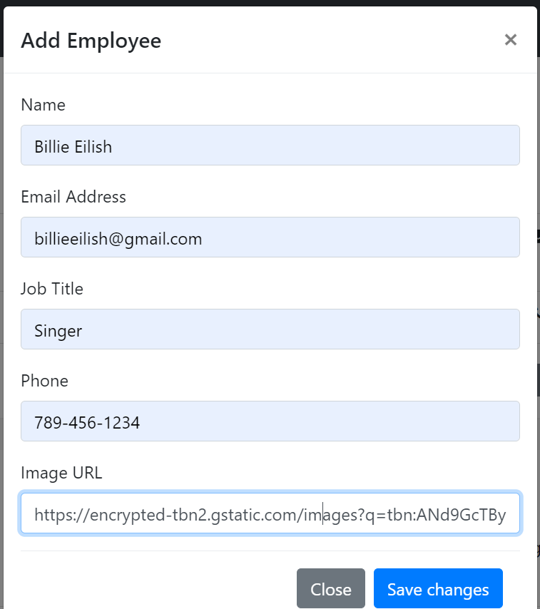
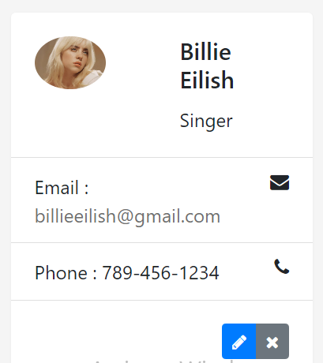
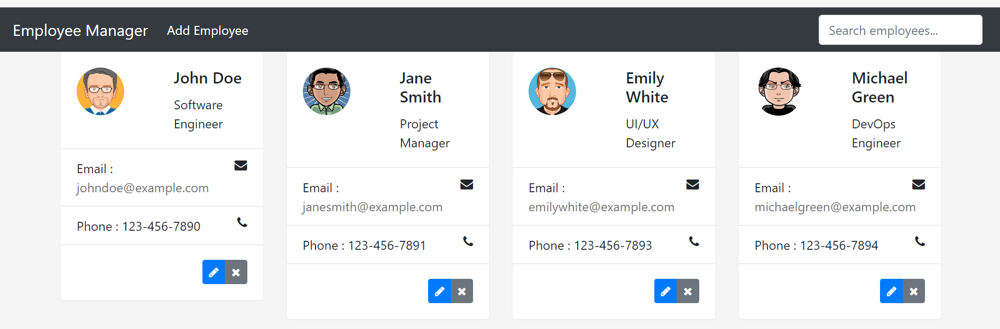
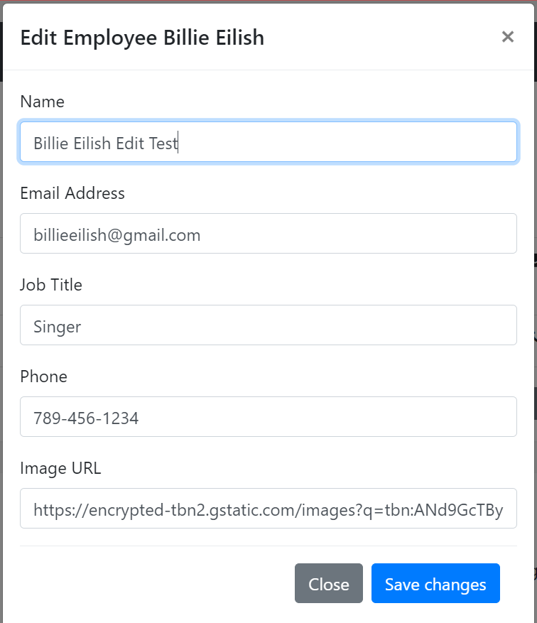
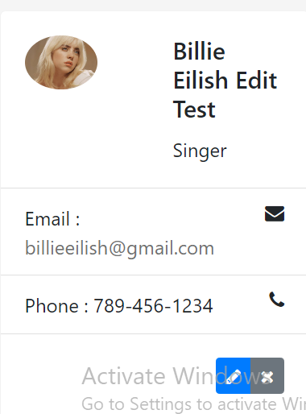
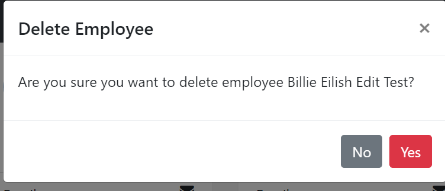

# Employee Manager

## Description
The Employee Manager is a full-stack web application designed to help organizations manage employee profiles efficiently. The application allows users to add, update, delete, and view employee details in a user-friendly web interface. It's ideal for HR departments and team leaders looking to streamline their employee management tasks.

## Technologies Used
- **Angular**: Used for building the frontend to provide a dynamic and responsive user interface.
- **Spring Boot**: Powers the backend, offering a robust framework for RESTful APIs and server-side logic.
- **MySQL**: Used for the database to store and manage employee data persistently.

## Setup Instructions
To set up the Employee Manager application locally, follow these steps:
1. **Database Setup**:
   - Install MySQL and create a database named `employeemanager`.
   - Run the SQL script located in `backend/sql/employeemanager.sql` to set up the tables.

2. **Backend Setup**:
   - Navigate to the `backend` directory.
   - Run `mvn clean install` to build the project.
   - Start the Spring Boot application by running `java -jar target/employeemanager-0.1.0.jar`.

3. **Frontend Setup**:
   - Navigate to the `frontend` directory.
   - Run `npm install` to install all dependencies.
   - Start the Angular application with `ng serve`.
   - Access the application at `http://localhost:4200`.

## Features
- **Add Employee**: Allows users to add new employees to the database.
- **Edit Employee**: Users can modify details of existing employees.
- **Delete Employee**: Provides the functionality to remove employees from the system.
- **View Employees**: Users can view a list of all employees and their details.

## Screenshots

Below are screenshots demonstrating the core functionalities of the Employee Manager application:

### Adding a New Employee
- **Add New Employee Form**: This form allows users to input details of a new employee.
  

### Adding an Employee Result
- **Employee Added**: This screenshot shows the result after successfully adding a new employee.
  
  
### Viewing All Employees
- **List of All Employees**: Displays all employees in the system with options to edit or delete.
  

### Editing an Employee
- **Edit Employee Form**: Users can update the details of existing employees.
  
- **Edited Employee**: Shows the confirmation and updated details after an employee has been successfully edited.
  

### Deleting an Employee
- **Delete Confirmation**: This action allows users to remove an employee from the system.
  

